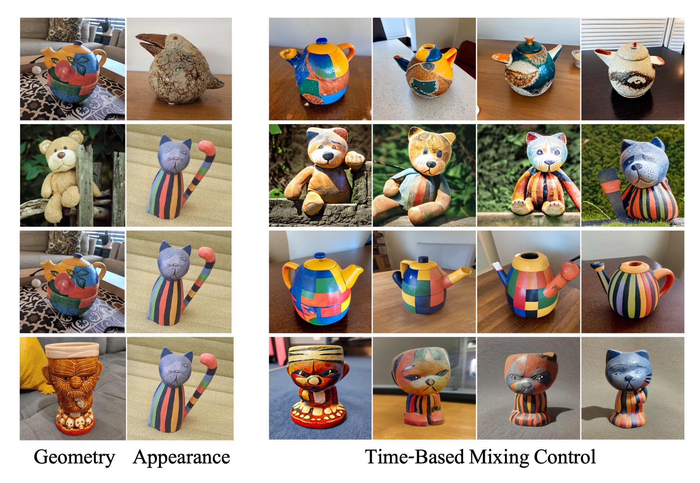

# A Neural Space-Time Representation for Text-to-Image Personalization

> A key aspect of text-to-image personalization methods is the manner in which the target concept is represented within the generative process. This choice greatly affects the visual fidelity, downstream editability, and disk space needed to store the learned concept. In this paper, we explore a new text-conditioning space that is dependent on both the denoising process timestep (time) and the denoising U-Net layers (space) and showcase its compelling properties. A single concept in the space-time representation is composed of hundreds of vectors, one for each combination of time and space, making this space challenging to optimize directly. Instead, we propose to implicitly represent a concept in this space by optimizing a small neural mapper that receives the current time and space parameters and outputs the matching token embedding. In doing so, the entire personalized concept is represented by the parameters of the learned mapper, resulting in a compact, yet expressive, representation. Similarly to other personalization methods, the output of our neural mapper resides in the input space of the text encoder. We observe that one can significantly improve the convergence and visual fidelity of the concept by introducing a textual bypass, where our neural mapper additionally outputs a residual that is added to the output of the text encoder. Finally, we show how one can impose an importance-based ordering over our implicit representation, providing users control over the reconstruction and editability of the learned concept using a single trained model. We demonstrate the effectiveness of our approach over a range of concepts and prompts, showing our method's ability to generate high-quality and controllable compositions without fine-tuning any parameters of the generative model itself.

 

  
 
Personalization results of our method under a variety of prompts. Our expressive representation enables one to generate novel compositions of personalized concepts that achieve high visual fidelity and editability without tuning the generative model. The bottom row shows our method's unique ability to control the reconstruction-editability tradeoff at inference time with a single trained model.

# Code Coming Soon!

## Personalized Text-to-Image Generation with NeTI

  
 
Sample text-guided personalized generation results obtained with NeTI.

## Controlling Editability with Nested Dropout

  
 
Using our dropout technique, users can control the balance between the generated image's visual and text fidelity at inference time. When a stronger dropout is applied we get a more coarse/semantic representation of our concept that is more amenable to edits and new compositions.

## Style Mixing

  
 
We can also mix the geometry and appearance of two learned concepts. By starting to perform the mixing at different timesteps, we can control how much information is passed from the geometry concept to the output image.

