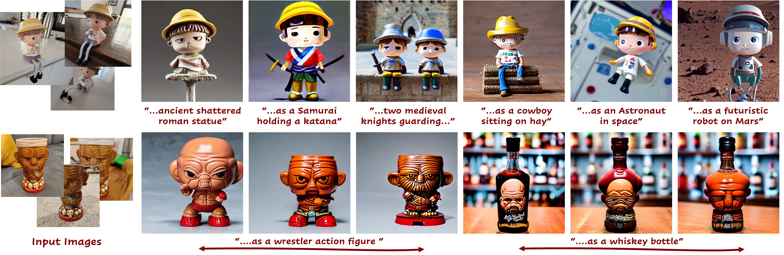
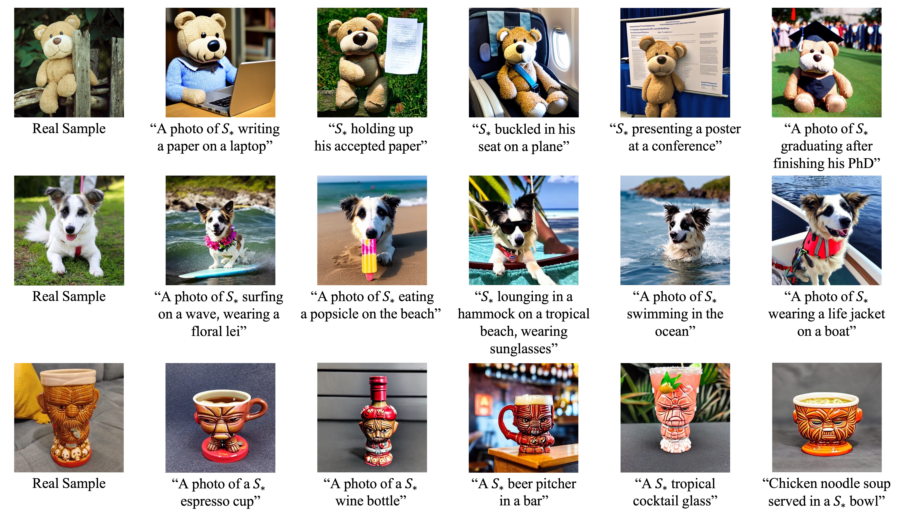
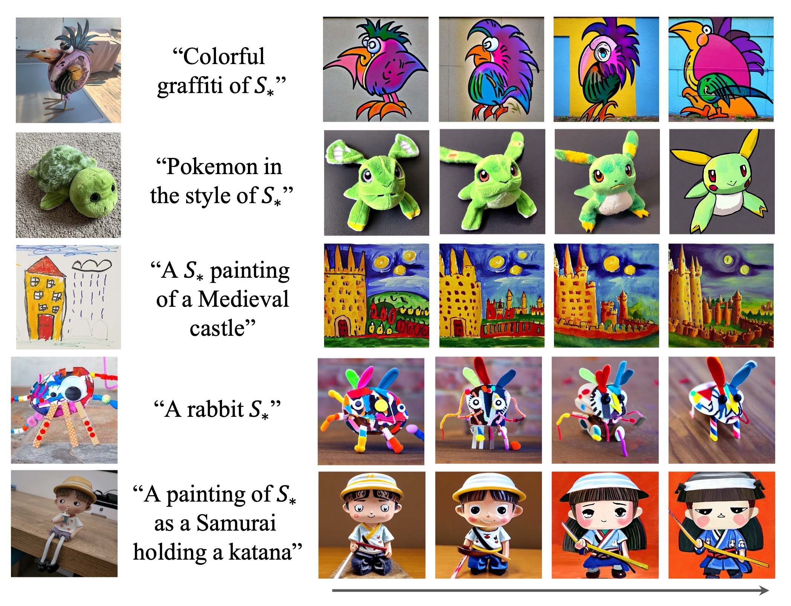

# A Neural Space-Time Representation for Text-to-Image Personalization

> A key aspect of text-to-image personalization methods is the manner in which the target concept is represented within the generative process. This choice greatly affects the visual fidelity, downstream editability, and disk space needed to store the learned concept. In this paper, we explore a new text-conditioning space that is dependent on both the denoising process timestep (time) and the denoising U-Net layers (space) and showcase its compelling properties. A single concept in the space-time representation is composed of hundreds of vectors, one for each combination of time and space, making this space challenging to optimize directly. Instead, we propose to implicitly represent a concept in this space by optimizing a small neural mapper that receives the current time and space parameters and outputs the matching token embedding. In doing so, the entire personalized concept is represented by the parameters of the learned mapper, resulting in a compact, yet expressive, representation. Similarly to other personalization methods, the output of our neural mapper resides in the input space of the text encoder. We observe that one can significantly improve the convergence and visual fidelity of the concept by introducing a textual bypass, where our neural mapper additionally outputs a residual that is added to the output of the text encoder. Finally, we show how one can impose an importance-based ordering over our implicit representation, providing users control over the reconstruction and editability of the learned concept using a single trained model. We demonstrate the effectiveness of our approach over a range of concepts and prompts, showing our method's ability to generate high-quality and controllable compositions without fine-tuning any parameters of the generative model itself.

<a href="https://neuraltextualinversion.github.io/NeTI/"></a> 
[](https://huggingface.co/spaces/neural-ti/NeTI)

<p align="center">
  
<br>
Personalization results of our method under a variety of prompts. Our expressive representation enables one to generate novel compositions of personalized concepts that achieve high visual fidelity and editability without tuning the generative model. The bottom row shows our method's unique ability to control the reconstruction-editability tradeoff at inference time with a single trained model.
</p>

# Table of Contents
- [Description](#description)
- [Setup](#setup)
  * [Conda Environment](#conda-environment)
- [Usage](#usage)
  * [Hugging Face Demo](#hugging-face-demo)
  * [Pretrained Models and Datasets](#pretrained-models-and-datasets)
  * [Training](#training)
  * [Inference](#inference)
    + [Controlling Editability with Nested Dropout](#controlling-editability-with-nested-dropout)
  * [CLIP-Based Metrics](#clip-based-metrics)
- [Acknowledgements](#acknowledgements)

# Description  
Official implementation of our NeTI paper.

# Setup
## Conda Environment
Our code relies on the enviornment in the official [Stable Diffusion repository](https://github.com/CompVis/stable-diffusion). To set up their environment, please run:
```
conda env create -f environment/environment.yaml
conda activate neti
```
On top of these requirements, we added several requirements which can be found in `environment/requirements.txt`. These requirements will be installed in the above command.

**Hugging Face Diffusers Library**  
Our code relies on the [diffusers](https://github.com/huggingface/diffusers) library and the official [Stable Diffusion v1.4](https://huggingface.co/CompVis/stable-diffusion-v1-4) model.

# Usage
<p align="center">
  
<br>
Sample text-guided personalized generation results obtained with NeTI.
</p>


## Hugging Face Demo 
You can try out some of our trained models using our HuggingFace Spaces app [here](https://huggingface.co/spaces/neural-ti/NeTI)


## Pretrained Models and Datasets
As part of our code release and to assist with comparisons, we have also provided some of the trained models and datasets used in the paper. 

All of our models can be found [here](https://drive.google.com/drive/folders/1fRLRpl-IRoKbHqQt6hQ7yFx9laUIa_-A?usp=sharing). 
All datasets used from Textual Inversion can be found [here](https://drive.google.com/drive/folders/19Axd0wDsdWza_jG0Jax9SeFdfTKnRdUJ?usp=sharing).

Note that datasets taken from CustomDiffusion, can be downloaded from their [official implementation](https://github.com/adobe-research/custom-diffusion).


## Training
To train your own concept, you can simply run the `scripts/train.py` script and pass a config file specifying all training parameters. For example,
```
python scripts/train.py --config_path input_configs/train.yaml
```
Notes:
- All training arguments can be found in the `RunConfig` class in `training/config.py` and are set to their defaults according to the official paper.
- For parsing the config and its parameters, we use the [pyrallis](https://github.com/eladrich/pyrallis) library. 


## Inference
To run inference on a trained model, you can run our `scripts/inference.py` script. An example config file is provided in `input_configs/inference.yaml`: 
```
python scripts/inference.py --config_path input_configs/inference.yaml
```
Notes: 
- You can either pass an `input_dir` and `iteration`, which we will then use to extract the corresponding mapper checkpoint and embeddings file, or you can directly pass specific values for `mapper_checkpoint_path` and `learned_embeds_path`.
- For specifying the prompts, you can either provide a list of prompts, or specify a path to a text file, where each line contains a prompt. For example:
    ```
    A photo of {}
    A photo of {} on a beach
    A colorful grafitti of {}
    ```
    - Note that the concept placement should be specified using `{}`. 
    - We will replace `{}` with the concept's placeholder token that is saved in the mapper checkpoint.
- Prompts used in the paper's evaluations are provided in `constants.py` under `PROMPTS`.
- Please refer to the `InferenceConfig` class for more details on all parameters.

All generated images will be saved to the path `{cfg.inference_dir}/{prompt}`. We will also save a grid of all images (in the case of multiple seeds) under `{cfg.inference_dir}`.

### Controlling Editability with Nested Dropout
<p align="center">
  
<br>
Using our dropout technique, users can control the balance between the generated image's visual and text fidelity at inference time.
</p>

To apply inference-time dropout, you can simply specify different values for `truncation_idxs` in the `InferenceConfig`. 
If a list of truncation values are specified, then results for each truncation value will be saved separately.


## CLIP-Based Metrics  
We use the same evaluation protocol as used in Textual Inversion. The main logic for computing the metrics can be found 
[here](https://github.com/rinongal/textual_inversion/blob/main/evaluation/clip_eval.py).


# Acknowledgements
Our code builds on the [diffusers implementation of textual inversion](https://github.com/huggingface/diffusers/tree/main/examples/textual_inversion) 
and the [unofficial implementation of XTI from cloneofsimo](https://github.com/cloneofsimo/promptplusplus).
